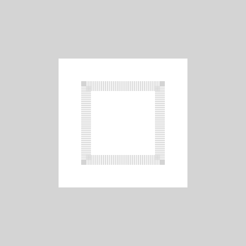
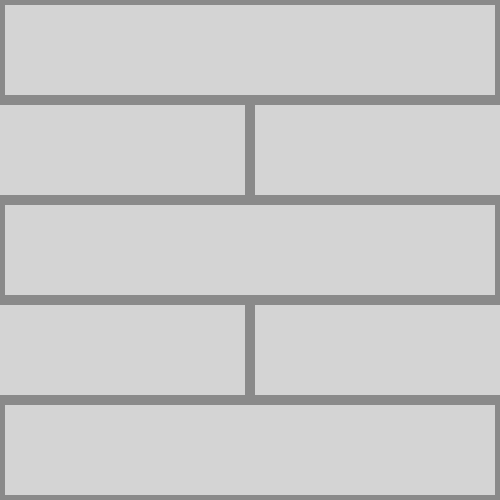

# Sokoban
**Built by [cocos2dx 4.0](https://www.cocos.com/en/cocos2d-x) & C++**

Our course project of SUSTech CS205: C/C++ Program Design, 2023 Fall. For detailed information,  please refer [requirement docs](docs/requirement.pdf).

### Installations

Official documentation: https://docs.cocos.com/cocos2d-x/v4/manual/en/installation/

For example, in VS 2022, create a new subfolder and then run

```powershell
cmake .. "Visual Studio 17 2022" -Tv143 -A win32
```

### Guidance in Chinese

How to install: https://www.bilibili.com/video/BV1ho4y1S7s3

Code sample for reference: https://gitee.com/at_He/moon-warriors

Tutorial video of sample: https://www.bilibili.com/video/BV1bs4y1H7dD

### Well Come to Recurse Box!

| Event       | Action                     |
| ----------- | -------------------------- |
| W A S D     | move up, down, left, right |
| Mouse wheel | zoom in / out              |
| R           | Restart                    |
| Backspace ← | Undo one step              |

**Level-function mapping: [here](Resources/level/)**

#### Box Example:

 Player
Player Target
Box
 Box Target
Boundary
Floor

